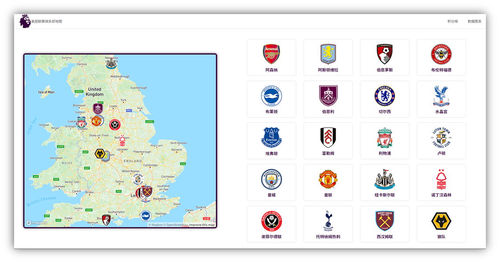

# England-Premier-League-Map

## Project Setup and Running

### Navigate to the backend directory

```shell
cd backend
```

### Create a virtual environment and activate it
```shell
python -m venv .venv
source .venv/bin/activate  # On Windows, use `.venv\Scripts\activate`
```

### Install the required packages
```shell
pip install -r requirements.txt
```

### Run the backend server
```shell
python app.py
```

### Open http://localhost:5000 in your browser 
